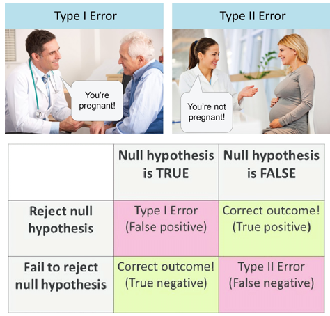
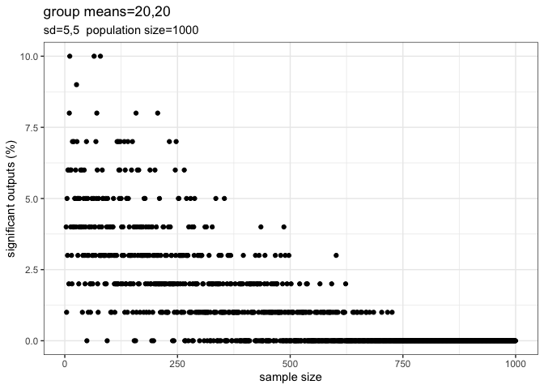
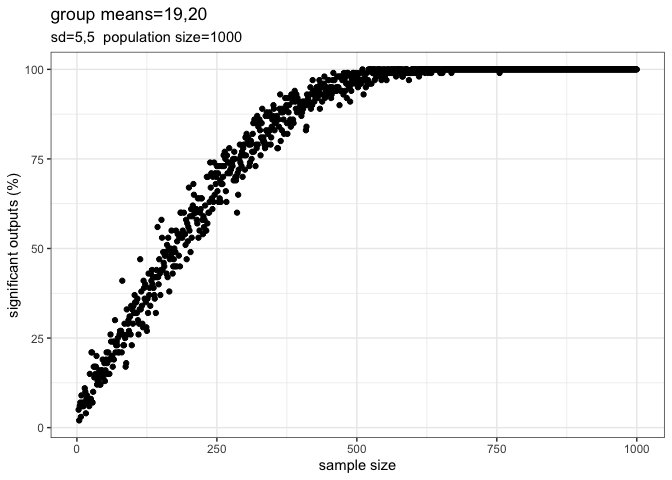

Sample size calculator
================
Jacob Brownscombe, PhD

## When applying and interpreting statistics it is important to understand (and try to avoid) type I and II errors

type I = rejection of a true null hypothesis (false positive- finding
significance when there is none)

type II = non-rejection of a false null hypothesis (false negative - not
finding significance when there
is)

<!-- -->

### This code generates a hypothetical dataset and assesses the probability of finding significant differences between groups with a t-test. You may find it useful for assessing the appropriate sample size to avoid type I and II statistical errors. An R worksheet with this code can be downloaded from this repository

``` r
# settings:
iterations = 100  #number of subsamples at each sample size
popn = 1000  #population size
low = 3  #min sample size
high = 100  #max sample size
amean = 15  #mean for sample a. if same as b, interpret significant outputs as type I error
bmean = 20  #mean for sample b
sda = 5  #standard deviation for a
sdb = 5  #standard deviation for b

## run simulations
output <- matrix(ncol = 1, nrow = iterations)
output2 <- matrix(ncol = 1, nrow = high - low + 1)

a <- rnorm(popn, amean, sda)
b <- rnorm(popn, bmean, sdb)

for (j in low:high) {
    for (i in 1:iterations) {
        a1 <- sample(a, size = j, replace = FALSE)
        b1 <- sample(b, size = j, replace = FALSE)
        t <- t.test(a1, b1)
        output[i] <- round(t$p.value, 3)
        sig <- length(which(output < 0.05))
    }
    output2[j - low + 1] <- (sig/iterations * 100)
}

output2 <- data.frame(output2)
output2$n <- low:high


# output:
library(ggplot2)  #might need to install if you don't have this package already
ggplot(output2, aes(x = n, y = output2)) + geom_point() + ggtitle(paste("group means=", 
    amean, ",", bmean, sep = ""), paste("sd=", sda, ",", sdb, "  population size=", 
    popn, sep = "")) + ylab("significant outputs (%)") + xlab("sample size") + theme_bw()
```

<!-- -->

With the above settings, in order to detect a significant difference
with sample means of 15,20 and sd=5 for both groups, population size of
1000, a sample size of ~30 would be sufficient to avoid type II error

### Examine potential for type II error relative to population size

not shown - same code as above with different settings shown in the
plot

<!-- -->

With larger population size (100,000), the potential for type II error
remains similar across sample
sizes

### Examine potential for type I errors based on sample size relative to population size

not shown - same code as above with different settings shown in the
plot

<!-- -->

Group means and standard deviations are the same (20,5), hence this is
the potential for type I error. Probability of type I error remains
about 5% until approaching sampling \>50-75% of the entire population,
which isn’t typically feasible in most
studies

### Real life, or biological significance is different from statistical significance

This can become an issue if sample sizes are too large, where
statistically significant differences may not be biologically
significant
differences:

<!-- -->

Here with group means of 19,20 and sd=5 (likely not biologically
relevant), with sufficient sample size, we will likely still find
statistical significance.

### Take home points:

  - It is important to assess what you perceive as a relevant (eg
    biologically relevant) difference between your groups.
  - This tool should help to assess the sufficient sample size to avoid
    type II errors, that is, you will likely find a significant
    difference if there is one.
  - Potential for type II error remains similar independent of population
    size and is more dependant on sample size.
  - Potential for type I error remains ~5% unless the majority of the
    population is sampled, however, in this case, small differences
    between groups have a high probability of being statistically
    significant
